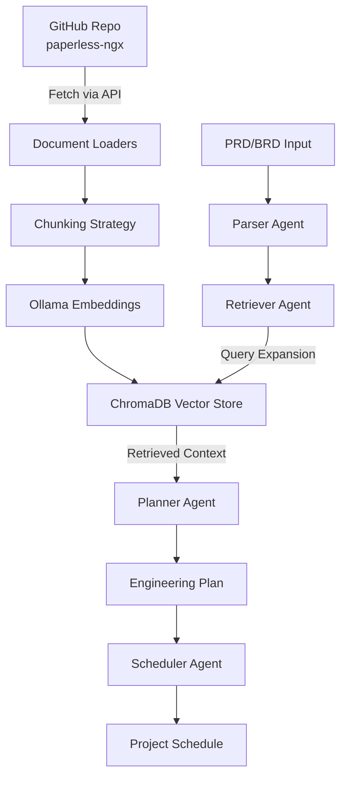

# RAG Integration Execution Plan

---

## Overview

Extend the BRD Agent to support incremental feature planning for existing systems by integrating RAG (Retrieval-Augmented Generation). The system will ingest documentation from GitHub repositories (configurable, with paperless-ngx as default test case) and use Query Expansion RAG to retrieve relevant context when processing PRDs/BRDs, ensuring generated engineering plans align with existing architecture and conventions.

**Multi-Repository Support**: The system is designed to work with any GitHub repository. Each repository gets its own ChromaDB collection, allowing you to switch between repos or work with multiple repos simultaneously. The default repository URL is configurable via `DEFAULT_REPO_URL` environment variable.

---

## Plan Structure

This plan has two organizational levels:

1. **Phases (Lines 27-190)**: High-level logical groupings for understanding the architecture. These are for reference only.
2. **Steps (Lines 230+)**: The actual implementation sequence. **Follow Steps 1-17 sequentially.**

**For Build Agents**: Implement Steps 1-17 in order. The Phases are organizational only and do not define the implementation order.

---

## Architecture Flow



---

## Phase 1: Foundation - RAG Infrastructure

### 1.1 Vector Database Setup

- **Location**: `src/brd_agent/services/vector_store.py`
- **Actions**:
  - Create ChromaDB service wrapper
  - Initialize persistent collection for repository documentation
  - Implement collection management (create, delete, list)
  - Add metadata schema for documents (repo, file_path, doc_type, timestamp)

### 1.2 Embedding Service

- **Location**: `src/brd_agent/services/embeddings.py`
- **Actions**:
  - Integrate Ollama embedding API (nomic-embed-text model)
  - Create embedding service abstraction (allows future swap to Voyage/others)
  - Implement batch embedding for efficiency
  - Add embedding model version tracking in metadata

### 1.3 Document Loaders

- **Location**: `src/brd_agent/services/document_loaders/`
- **Actions**:
  - Create GitHub API client wrapper (`github_loader.py`)
  - Implement Markdown loader (header-aware)
  - Implement code file loader (extract docstrings/comments)
  - Implement OpenAPI/Swagger loader
  - Create unified document interface

### 1.4 Chunking Strategies

- **Location**: `src/brd_agent/services/chunking.py`
- **Actions**:
  - Implement header-based chunking for Markdown
  - Implement code-aware chunking (function/class boundaries)
  - Implement recursive chunking (fallback)
  - Add chunk metadata (source file, line numbers, chunk type)

---

## Phase 2: Ingestion Pipeline

### 2.1 CLI Bulk Ingestion Tool

- **Location**: `cli/ingest.py`
- **Actions**:
  - Create CLI command: `python -m cli.ingest github <repo-url>`
  - Fetch repository structure via GitHub API
  - Identify document types (Markdown, code, OpenAPI, etc.)
  - Process files through appropriate loaders
  - Chunk documents using strategy selector
  - Generate embeddings via Ollama
  - Store in ChromaDB with metadata
  - Show progress and summary statistics

### 2.2 API Incremental Updates

- **Location**: `api/main.py` (new endpoints)
- **Actions**:
  - `POST /api/ingest/document` - Ingest single document
  - `POST /api/ingest/repo-path` - Ingest specific path from repo
  - `DELETE /api/ingest/document` - Remove document from vector store
  - `GET /api/ingest/status` - Check ingestion status
  - Support for updating existing documents (delete + re-ingest)

---

## Phase 3: Query Expansion RAG

### 3.1 Retriever Agent

- **Location**: `src/brd_agent/agents/retriever.py`
- **Actions**:
  - Create RetrieverAgent extending BaseAgent
  - Implement Query Expansion logic:

    1. Analyze BRD/PRD content
    2. Generate 3-5 targeted queries using LLM
    3. Execute parallel searches in ChromaDB
    4. Deduplicate and rank results
    5. Return top-K relevant chunks

  - Add query result caching for performance

### 3.2 Integration with Workflow

- **Location**: `src/brd_agent/graph/workflow.py`
- **Actions**:
  - Add RetrieverAgent node between Parser and Planner
  - Update AgentState to include `retrieved_context` field
  - Modify workflow: `Parser → Retriever → Planner → Scheduler`
  - Make RAG optional (graceful degradation if no context available)

### 3.3 Planner Agent Enhancement

- **Location**: `src/brd_agent/agents/planner.py`
- **Actions**:
  - Update `_build_prompt()` to include retrieved context
  - Add system context section to prompt (architecture, tech stack, conventions)
  - Instruct LLM to align plans with existing system patterns
  - Add context source citations in metadata

---

## Phase 4: GitHub Integration

### 4.1 GitHub API Client

- **Location**: `src/brd_agent/services/github_client.py`
- **Actions**:
  - Create GitHub API wrapper using `httpx` or `PyGithub`
  - Implement repository tree fetching
  - Implement file content fetching (with rate limit handling)
  - Support for public repositories (no auth required initially)
  - Add caching for API responses

### 4.2 Repository Discovery

- **Location**: `src/brd_agent/services/repository_analyzer.py`
- **Actions**:
  - Analyze repository structure
  - Identify documentation locations (docs/, README, etc.)
  - Detect code structure (Python, TypeScript, etc.)
  - Find OpenAPI/Swagger specs
  - Generate ingestion plan

---

## Phase 5: Testing & Validation

### 5.1 Test with paperless-ngx

- **Actions**:
  - Ingest paperless-ngx repository documentation
  - Create sample PRD for a new feature
  - Verify retrieved context is relevant
  - Validate engineering plan aligns with Django/Python patterns
  - Check that tech stack recommendations match existing stack

### 5.2 End-to-End Testing

- **Actions**:
  - Test CLI bulk ingestion
  - Test API incremental updates
  - Test full workflow with RAG enabled
  - Test graceful degradation (no context available)
  - Performance testing (embedding generation, retrieval speed)

---

## Phase 6: Configuration & Documentation

### 6.1 Configuration Updates

- **Location**: `src/brd_agent/config.py`
- **Actions**:
  - Add ChromaDB path configuration
  - Add Ollama embedding model URL
  - Add GitHub API rate limit settings
  - Add RAG parameters (top-K, query count, etc.)
  - Add default repository URL (for testing/development): `default_repo_url` (default: `https://github.com/paperless-ngx/paperless-ngx`)
  - Add support for multiple repositories (collection per repo, identified by repo URL)

### 6.2 Documentation

- **Actions**:
  - Update README with RAG setup instructions
  - Document CLI ingestion commands
  - Document API endpoints for incremental updates
  - Add examples of PRD processing with RAG
  - Document configuration options (including `default_repo_url` in `.env`)
  - Explain multi-repository support (how to switch repos, how collections are named)
  - Add example: "To use a different repository, set `DEFAULT_REPO_URL` in `.env` or pass repo URL to CLI/API"

---

## Key Files to Create/Modify

### New Files

- `src/brd_agent/services/vector_store.py` - ChromaDB wrapper
- `src/brd_agent/services/embeddings.py` - Ollama embedding service
- `src/brd_agent/services/document_loaders/` - Document loader modules
- `src/brd_agent/services/chunking.py` - Chunking strategies
- `src/brd_agent/services/github_client.py` - GitHub API client
- `src/brd_agent/services/repository_analyzer.py` - Repo structure analyzer
- `src/brd_agent/agents/retriever.py` - RetrieverAgent
- `cli/ingest.py` - CLI ingestion tool

### Modified Files

- `src/brd_agent/graph/workflow.py` - Add RetrieverAgent node
- `src/brd_agent/graph/state.py` - Add `retrieved_context` to AgentState
- `src/brd_agent/agents/planner.py` - Enhance prompt with context
- `api/main.py` - Add ingestion endpoints
- `src/brd_agent/config.py` - Add RAG configuration
- `requirements.txt` - Add chromadb, ollama, pygithub/httpx

---

## Dependencies to Add

- `chromadb>=0.4.0` - Vector database
- `ollama>=0.1.0` - Ollama API client (or use httpx directly)
- `PyGithub>=2.0.0` or `httpx>=0.27.0` - GitHub API access
- `langchain-text-splitters>=0.3.0` - Chunking utilities (optional)

---

## Repository Configuration

The system is designed to work with any GitHub repository. Repository URLs are configurable and the system supports multiple repositories simultaneously.

### Configuration Options

**Environment Variables** (in `.env`):

- `DEFAULT_REPO_URL` - Default repository URL for testing/development (default: `https://github.com/paperless-ngx/paperless-ngx`)
- `RAG_ENABLED` - Enable/disable RAG feature (default: `False`)
- `RAG_TOP_K` - Number of chunks to retrieve (default: `5`)
- `RAG_QUERY_COUNT` - Number of expanded queries (default: `3`)

### How Multi-Repository Works

1. **Collection Naming**: Each repository gets its own ChromaDB collection, named based on the normalized repository URL
2. **CLI Usage**:

   - `python -m cli.ingest github` - Uses default repo from config
   - `python -m cli.ingest github <repo-url>` - Ingest specific repo

3. **API Usage**: All ingestion endpoints accept optional `repo_url` parameter
4. **Workflow Usage**: BRD processing can specify `repo_url` in the request, or use default
5. **Switching Repos**: Simply ingest a different repo - it creates a new collection. Query by passing the repo URL

### Example: Using Different Repositories

```bash
# Ingest paperless-ngx (default)
python -m cli.ingest github

# Ingest a different Django project
python -m cli.ingest github https://github.com/django/django

# Ingest a Node.js project
python -m cli.ingest github https://github.com/expressjs/express

# Process BRD with specific repo context
curl -X POST http://localhost:8000/api/process-brd \
  -H "Content-Type: application/json" \
  -d '{
    "project": {...},
    "repo_url": "https://github.com/django/django"
  }'
```

---

## Success Criteria

1. Successfully ingest any GitHub repository documentation into ChromaDB (tested with paperless-ngx)
2. Process a PRD and retrieve relevant context from the specified repository
3. Generate engineering plan that references existing architecture patterns from the ingested repo
4. Tech stack recommendations align with the existing stack in the repository
5. CLI and API endpoints work for bulk and incremental ingestion with any repo URL
6. System gracefully handles missing context (works without RAG)
7. System supports multiple repositories simultaneously (each with its own collection)
8. Repository URL is configurable via environment variable or API/CLI parameters

---

## Step-by-Step Implementation Guide

**IMPORTANT: This is the ACTUAL implementation order. Follow Steps 1-17 sequentially.**

The "Phases" section above provides logical groupings for understanding the architecture, but **Steps 1-17 below are the definitive implementation sequence**. The Build Agent should follow the Steps, not the Phases.

This guide breaks down the implementation into small, testable increments. Each step can be implemented independently and tested before moving to the next.

---

### Step 1: Setup & Configuration (Foundation)

**Goal**: Add dependencies and basic configuration

**Tasks**:

- Update `requirements.txt` with: `chromadb>=0.4.0`, `httpx>=0.27.0`
- Update `src/brd_agent/config.py` to add:
  - `chromadb_path` (default: `./.chromadb`)
  - `ollama_embedding_url` (default: `http://localhost:11434`)
  - `ollama_embedding_model` (default: `nomic-embed-text`)
  - `rag_enabled` (default: `False` - feature flag)
  - `default_repo_url` (default: `https://github.com/paperless-ngx/paperless-ngx` - configurable test repo)
  - `rag_top_k` (default: `5` - number of chunks to retrieve)
  - `rag_query_count` (default: `3` - number of expanded queries)

**Key Requirements**:

- `default_repo_url` must be configurable via `DEFAULT_REPO_URL` environment variable
- System must support multiple repositories simultaneously (each repository gets its own ChromaDB collection)
- Collection names should be derived from normalized repository URLs
- Configuration should load from `.env` file with sensible defaults

**Test**:

- Verify config loads without errors
- Verify `default_repo_url` can be overridden via `DEFAULT_REPO_URL` environment variable
- Verify all configuration values have appropriate defaults

**Note**: The `default_repo_url` is for convenience in testing/development. The system supports multiple repositories - each repo gets its own ChromaDB collection identified by the repo URL. See "Repository Configuration" section for details on multi-repository support.

---

### Step 2: ChromaDB Vector Store Service

**Goal**: Create basic vector store wrapper

**Tasks**:

- Create `src/brd_agent/services/vector_store.py`
- Implement `VectorStore` class with:
  - `__init__()` - Initialize ChromaDB client
  - `get_collection_name(repo_url)` - Generate collection name from repo URL (normalize URL to identifier)
  - `create_collection(repo_url)` - Create collection for a repository
  - `get_collection(repo_url)` - Get existing collection for a repository
  - `add_documents(repo_url, documents, embeddings, metadata)` - Add docs to repo's collection
  - `query(repo_url, query_embedding, top_k)` - Search in repo's collection
  - `list_collections()` - List all ingested repositories

**Test**: Create a test script that:

```python
from src.brd_agent.services.vector_store import VectorStore
store = VectorStore()
repo_url = "https://github.com/paperless-ngx/paperless-ngx"
collection = store.create_collection(repo_url)
# Add a test document
# Query and verify results
```

**Note**: Collections are named based on repository URL (normalized). This allows multiple repos to coexist.

---

### Step 3: Ollama Embedding Service

**Goal**: Create embedding service using Ollama

**Tasks**:

- Create `src/brd_agent/services/embeddings.py`
- Implement `EmbeddingService` class with:
  - `__init__()` - Setup Ollama client (httpx)
  - `embed(text)` - Generate embedding for single text
  - `embed_batch(texts)` - Batch embeddings
  - `get_model_info()` - Return model name/version

**Prerequisites**: Ollama must be running locally with `nomic-embed-text` model

**Test**:

```python
from src.brd_agent.services.embeddings import EmbeddingService
emb = EmbeddingService()
vector = emb.embed("test document")
assert len(vector) == 768  # nomic-embed-text dimension
```

---

### Step 4: Basic Chunking Strategy

**Goal**: Implement simple chunking for Markdown

**Tasks**:

- Create `src/brd_agent/services/chunking.py`
- Implement `chunk_markdown(text)` - Split by headers (##, ###)
- Implement `chunk_recursive(text, chunk_size, overlap)` - Fallback
- Return list of chunks with metadata (source, line_start, line_end)

**Test**:

```python
from src.brd_agent.services.chunking import chunk_markdown
chunks = chunk_markdown("# Title\n## Section 1\nContent\n## Section 2\nMore")
assert len(chunks) == 2
```

---

### Step 5: GitHub API Client (Basic)

**Goal**: Fetch files from GitHub repository

**Tasks**:

- Create `src/brd_agent/services/github_client.py`
- Implement `GitHubClient` class with:
  - `__init__()` - Setup httpx client
  - `parse_repo_url(repo_url)` - Parse GitHub URL to extract owner/repo
  - `get_repo_tree(repo_url, path="")` - Get directory tree (accepts full URL or owner/repo)
  - `get_file_content(repo_url, path)` - Fetch file content (accepts full URL or owner/repo)
  - Handle rate limits (basic retry logic)

**Test**:

```python
from src.brd_agent.services.github_client import GitHubClient
client = GitHubClient()
# Test with full URL
readme = client.get_file_content("https://github.com/paperless-ngx/paperless-ngx", "README.md")
assert "paperless" in readme.lower()
# Test with owner/repo tuple
readme2 = client.get_file_content(("paperless-ngx", "paperless-ngx"), "README.md")
```

---

### Step 6: Markdown Document Loader

**Goal**: Load and parse Markdown files from GitHub

**Tasks**:

- Create `src/brd_agent/services/document_loaders/__init__.py`
- Create `src/brd_agent/services/document_loaders/markdown_loader.py`
- Implement `load_markdown(content, source_path)` - Parse markdown
- Return structured document with metadata

**Test**: Load README.md from paperless-ngx and verify structure

---

### Step 7: End-to-End Ingestion (Manual Test)

**Goal**: Manually ingest one document to verify pipeline

**Tasks**:

- Create test script `scripts/test_ingestion.py`:

  1. Fetch README.md from paperless-ngx via GitHubClient
  2. Load via MarkdownLoader
  3. Chunk via chunking service
  4. Generate embeddings via EmbeddingService
  5. Store in ChromaDB via VectorStore
  6. Query and verify retrieval works

**Test**: Run script and verify document is stored and retrievable

---

### Step 8: CLI Bulk Ingestion Tool

**Goal**: Create CLI command for bulk ingestion

**Tasks**:

- Create `cli/ingest.py` with `typer` CLI
- Implement `github` command:
  - Accept optional `repo_url` argument (defaults to `config.default_repo_url`)
  - Parse repo URL: `https://github.com/owner/repo`
  - Fetch repo tree
  - Filter for markdown files (`.md`, `.rst`)
  - Process each file through pipeline
  - Store in collection named after repo URL
  - Show progress bar
  - Display summary stats

**Test**:

```bash
# Use default repo from config
python -m cli.ingest github

# Use specific repo
python -m cli.ingest github https://github.com/paperless-ngx/paperless-ngx

# Use different repo
python -m cli.ingest github https://github.com/owner/other-repo
```

---

### Step 9: Retriever Agent (Basic)

**Goal**: Create RetrieverAgent with simple retrieval (no query expansion yet)

**Tasks**:

- Create `src/brd_agent/agents/retriever.py`
- Implement `RetrieverAgent` extending `BaseAgent`
- Implement `run(parsed_brd, repo_url=None)` - Simple retrieval:

  1. Use `repo_url` if provided, else fall back to `config.default_repo_url`
  2. Extract key terms from BRD
  3. Generate embedding for BRD summary
  4. Query ChromaDB collection for the specified repo
  5. Return top-K chunks with source metadata

**Test**: Create test BRD, run RetrieverAgent with different repo URLs, verify chunks returned

---

### Step 10: Query Expansion (Advanced Retrieval)

**Goal**: Add Query Expansion to RetrieverAgent

**Tasks**:

- Enhance `RetrieverAgent.run()`:

  1. Use LLM to generate 3-5 targeted queries from BRD
  2. Generate embeddings for each query
  3. Query ChromaDB for each query
  4. Merge and deduplicate results
  5. Rank by relevance
  6. Return top-K chunks

**Test**: Verify expanded queries improve retrieval quality

---

### Step 11: Workflow Integration

**Goal**: Add RetrieverAgent to BRD workflow

**Tasks**:

- Update `src/brd_agent/graph/state.py` - Add:
  - `retrieved_context: Optional[list]` field
  - `repo_url: Optional[str]` field (for specifying which repo to query)
- Update `src/brd_agent/graph/workflow.py`:
  - Add `_retriever_node()` method
  - Insert RetrieverAgent node between Parser and Planner
  - Pass `repo_url` from state to RetrieverAgent (or use default)
  - Make RAG optional (check if collection exists, if not skip)

**Test**: Run full workflow with RAG enabled, verify context flows to Planner. Test with different repo URLs.

---

### Step 12: Planner Agent Enhancement

**Goal**: Use retrieved context in Planner prompts

**Tasks**:

- Update `src/brd_agent/agents/planner.py`:
  - Modify `_build_prompt()` to accept `retrieved_context` parameter
  - Add "System Context" section to prompt with retrieved chunks
  - Update prompt instructions to align with existing patterns
  - Add source citations in metadata

**Test**: Generate plan with RAG, verify it references existing architecture

---

### Step 13: API Endpoints for Ingestion

**Goal**: Add REST API endpoints for incremental updates

**Tasks**:

- Update `api/main.py`:
  - `POST /api/ingest/document` - Ingest single document (accepts `repo_url` parameter)
  - `POST /api/ingest/repo-path` - Ingest path from repo (accepts `repo_url` parameter)
  - `GET /api/ingest/status` - Check ingestion status (optionally filter by `repo_url`)
  - `GET /api/ingest/repos` - List all ingested repositories
  - `DELETE /api/ingest/document` - Remove document (accepts `repo_url` parameter)
  - `DELETE /api/ingest/repo` - Remove entire repository collection

**Test**: Use curl/Postman to test each endpoint with different repo URLs

---

### Step 14: Code-Aware Chunking

**Goal**: Add chunking for source code files

**Tasks**:

- Enhance `src/brd_agent/services/chunking.py`:
  - Implement `chunk_code(content, language)` - Split by functions/classes
  - Detect language from file extension
  - Extract docstrings/comments

**Test**: Chunk Python file, verify functions are separate chunks

---

### Step 15: Repository Analyzer

**Goal**: Automatically discover documentation in repos

**Tasks**:

- Create `src/brd_agent/services/repository_analyzer.py`
- Implement `analyze_repo(owner, repo)`:
  - Find docs/ directory
  - Find README files
  - Detect code structure
  - Generate ingestion plan

**Test**: Analyze paperless-ngx, verify it finds docs correctly

---

### Step 16: End-to-End Testing

**Goal**: Full system test with paperless-ngx

**Tasks**:

- Ingest paperless-ngx documentation
- Create sample PRD for new feature
- Process PRD through full workflow
- Verify:
  - Context is retrieved
  - Plan references Django/Python patterns
  - Tech stack matches existing system

---

### Step 17: Documentation & Polish

**Goal**: Document the RAG feature

**Tasks**:

- Update README with RAG setup instructions
- Document CLI commands
- Document API endpoints
- Add example PRD processing workflow

---

## Recommended Implementation Order

**Week 1**: Steps 1-7 (Foundation & Manual Testing)

- Setup, vector store, embeddings, chunking, GitHub client, basic ingestion

**Week 2**: Steps 8-12 (Integration)

- CLI tool, RetrieverAgent, workflow integration, Planner enhancement

**Week 3**: Steps 13-16 (Advanced Features & Testing)

- API endpoints, code chunking, repository analyzer, end-to-end testing

**Week 4**: Step 17 (Documentation)

- Polish and documentation

---

## How to Work with Build Agent

1. **Start with Step 1**: Give Build Agent the plan and ask to implement Step 1
2. **Test each step**: Verify the step works before moving to next
3. **Incremental handoff**: For each step, provide:

   - "Implement Step X: [Step Name]"
   - Reference the plan file
   - Ask for test verification

4. **Iterate**: If a step needs adjustment, fix it before proceeding

**Example prompt for Build Agent**:

```
You are a Build Agent. Please implement Step 1: Setup & Configuration 
from the RAG Integration plan. 

Reference: .cursor/plans/implementation_plan_for_incremental_feature_85db7573.plan.md

Follow the tasks, key requirements, and test criteria specified in Step 1 of the plan.
After implementation, verify all test criteria are met.
```

**Note**: Each step in the plan is self-contained with:

- Clear goal
- Detailed tasks
- Key requirements (if any)
- Test criteria
- Prerequisites (if any)

The Build Agent should be able to implement any step by reading the plan directly without additional context.

---

## Implementation Order

**Follow Steps 1-17 sequentially (see "Step-by-Step Implementation Guide" above).**

The implementation order is:

1. **Step 1** - Setup & Configuration
2. **Steps 2-6** - Foundation (Vector Store, Embeddings, Chunking, GitHub Client, Loaders)
3. **Steps 7-8** - Ingestion Pipeline (Manual Test, CLI Tool)
4. **Steps 9-12** - RAG Integration (Retriever Agent, Query Expansion, Workflow, Planner Enhancement)
5. **Step 13** - API Endpoints for Ingestion
6. **Steps 14-15** - Advanced Features (Code Chunking, Repository Analyzer)
7. **Step 16** - End-to-End Testing
8. **Step 17** - Documentation & Polish

**Note**: The "Phases" section earlier in this document are logical groupings for reference only. The actual implementation sequence is defined by Steps 1-17.